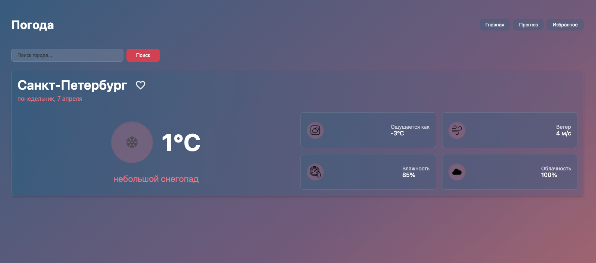

## ссылка на деплой 
https://test-work595.vercel.app/

### Как запустить проект локально

1. Клонировать репозиторий
2. Перейти в папку: cd weather-app
3. npm install
4. npm run dev

### Что было сделано  

1) Next.js + TS 
2) Выполнил требование по структуре страниц 
3) Использовал styled-components вместо bootstrap и scss modules (решил немного усложнить задачу, но scss модули были бы лаконичнее конечно, переделывать времени не было)
4) Работа с апи
5) Стейтменеджер Zustand
6) Валидация ошибок и отзывчивость 
7) ESLint

  
   
  

